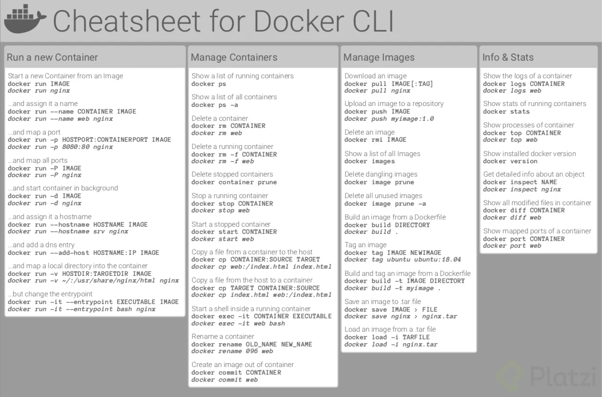
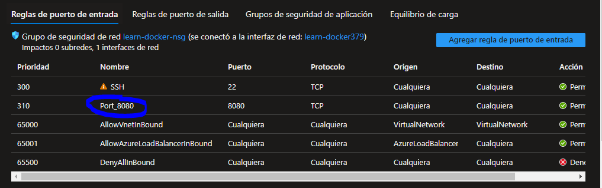
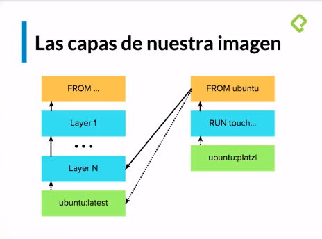
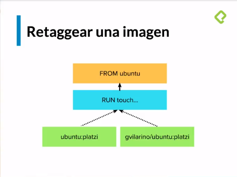
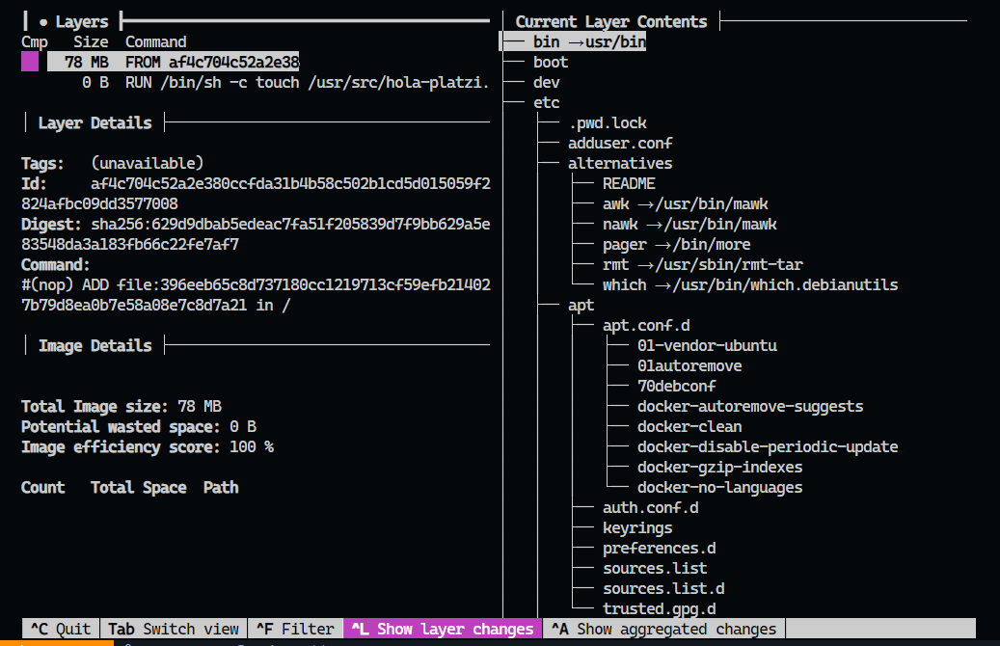

# Docker (Platzi)

Curso de Platzi de Docker

## Los 3 grandes problemas del desarrollo de software

Cuando creamos software normalmente podemos tener ciertos problemas al crear software

### Cuando construimos software

- Entorno de desarrollo: 

- Dependencias: Dependencias, Frameworks y que funcione de la misma manera

- Entorno de ejecución: Que versión de Node, etc

- Equivalencia con entorno productivo: Si estas programando en Windows pero vas a subirlo a un servidor Linux.

- Servicios externos: Tener la misma versión de una db externa.

### Cuando distribuimos software

- Acceso a los servidores de producción

- Disponibilidad de servicios externos

### Problemas al ejecutar

- Compatibilidad de OS.

- Recursos de hardware

## Virtualización

Permite solucionar los 3 problemas del software. En Docker se piensa que aunque puede solucionarse con VM puede hacerse mejor

### Problemas con VM

1. El inicio es muy lento por motivos de peso como OS

2. Requiere más administración

3. Múltiples formatos de VMs, dependiendo del proveedor puede tener cierto formato disponible

## Contenedores

Una forma de transportar software, algunas de sus ventajas pueden ser:

- Flexibles: Cualquier app puedes meter en un contenedor

- Livianos: Reutilizar el kernel y código del OS y solo empaquetar el código y no el OS

- Portables: Capacidad de correr en cualquier maquina

- Bajo acoplamiento: Tiene todo lo que necesita sin importarle lo que este en el OS

- Son escalables: Si necesitas más ancho de banda o más clientes es fácil crear muchos clientes

- Seguros: Solo puede acceder a lo que necesita, no a otros contenedores, máquina anfitriona, etc.

## Conceptos fundamentales: Docker

Es como una VM, pero más ligera y rápida.


## Instalación de Docker

En windows solo se le da siguiente :v [](https://docs.docker.com/install/windows/)


### Instalación en Linux

[Linux](https://docs.docker.com/desktop/install/linux-install/)
[Ubuntu](https://docs.docker.com/desktop/install/ubuntu/)

### Demas sistemas

Ahí estan las guías :D [Link](https://docs.docker.com/get-docker/)

## Hoja de comandos del CLI de Docker



Comandos:
```bash
# corro el contenedor hello-world
$ docker run hello-world
# muestra los contenedores activos
$ docker ps
# muestra todos los contenedores
$ docker ps -a
# muestra el detalle completo de un contenedor
$ docker inspect <containe ID>
# igual que el anterior pero invocado con el nombre
$ docker inspect <name>
# le asigno un nombre custom “hello-platzi”
$ docker run –-name hello-platzi hello-world
# cambio el nombre de hello-platzi a hola-platzy
$ docker rename hello-platzi hola-platzy
# borro un contenedor
$ docker rm <ID o nombre>
# borro todos lo contenedores que esten parados
$ docker container prune
```

## Posibles errores en docker

docker: Got permission denied while trying to connect to the Docker daemon socket at unix:///var/run/docker.sock: Post "http://%2Fvar%2Frun%2Fdocker.sock/v1.24/containers/create": dial unix /var/run/docker.sock: connect: permission denied.
See 'docker run --help'.

```bash
sudo usermod -aG docker $USER
sudo reboot
```

## Modo interactivo

```bash
$ docker run ubuntu (corre un ubuntu pero lo deja apagado)
$ docker ps -a (lista todos los contenedores)
$ docker -it ubuntu (lo corre y entro al shell de ubuntu)
-i: interactivo
-t: abre la consola

cat /etc/lsb-release (veo la versión de Linux)
```

## Ciclo de vida de un contenedor

```bash
# veo todos los contenedores
$ docker ps -a
# template de flag detachable
$ docker --name <nombre> -d ubuntu -f <comando>
# mantiene el contenedor activo
$ docker --name alwaysup -d ubuntu tail -f /dev/null
# entro al contenedor
$ docker exec -it alwaysup bash
# Detiene el contenedor pero se puede ver en el comando docker ps -a
$ docker stop alwaysup
# veo el main process del ubuntu (foreground)
$ docker inspect --format ‘{{.State.Pid}}’ alwaysup
# desde Linux si ejecuto kill -9 <PID> mata el proceso dentro del contenedor de ubuntu pero desde MAC no funciona
```

El flag -d es un detach para correr en background

## Exponiendo contenedores

En esta clase hubieron temas interesantes como la creación de un server en nginx

### Creando un contenedor con nginx e instalando nginx

Descargamos la imagen :D

```bash
$ docker run -d --name proxy nginx
```

Apaga el contenedor

```bash
$ docker stop proxy
```

Hacemos publico el puerto del contenedor en el puerto del equipo local 8080. Si no escribimos el detach entonces se quedara la consola recibiendo peticiones

```bash
$ docker run -d --name proxy -p 8080:80 nginx
```

### Mirar los logs de un contenedor

Ver los logs completos

```bash
$ docker logs proxy
```

Ver los logs completos y escuchando los que siguen

```bash
$ docker logs -f proxy
```

Ver los últimos 10 logs y escuchar los que siguen

```bash
$ docker logs --tail 10 -f proxy
```

### Agregando reglas para vm en azure



## Volumenes

Es como usar los **bind mounts** pero solo docker puede acceder a la información de esos archivos.

```bash
# listo los volumes
$ docker volume ls
# creo un volume
$ docker volume create dbdata
# corro la BBDD y monto el volume
$ docker run -d --name db --mount src=dbdata,dst=/data/db mongo
# veo la información detallada del contenedor
$ docker inspect db
# me conecto a la BBDD
$ mongo
```

## Insertar y extraer datos de un contenedor

```bash
Comandos:

# creo un archivo en mi máquina
$ touch prueba.txt
# corron un ubuntu y le agrego el tail con -f para que quede activo
$ docker run -d --name copytest ubuntu tail -f /dev/null
# entro al contenedor
$ docker exec -it copytest bash
# creo un directorio en el contenedor
$ mkdir testing
# copio el archivo dentro del contenedor
$ docker cp prueba.txt copytest:/testing/test.txt
# copio el directorio de un contenedor a mi máquina
$ docker cp copytest:/testing localtesting
con “docker cp” no hace falta que el contenedor esté corriendo
```

## Conceptos fundamentales de Docker: Images

Una forma sencilla de ver una imagen es tomando por ejemplo la POO, si la instancia de una clase es un contenedor entonces la imagen es la clase

Listar la imagenes:

```bash
$ docker images ls
```

Descargar una imagen de docker hub

```bash
$ docker pull ubuntu:16.04
```

## Construyendo nuestra propia imagen.

Al final las imagenes son un conjunto de capas.



Para crear nuestra propia imagen primero necesitamos un archivo llamado **Dockerfile** En el caso de este repo la cree en la carpeta custom.

```bash
$ docker build -t <base_image>:<tag_name> <Dockerfile_context>
```

```bash
$ docker build -t ubuntu:platzi .
```

Para poder subir tu imagen a docker hub primer ejecutas:

```bash
$ docker login
```

Esto sera similar a git

```bash
$ docker push <base_image>:<tag_name>
```

```bash
$ docker push ubuntu:platzi
```

Cambiar el tag de una imagen

```bash
docker tag ubuntu:platzi miguel2351/ubuntu:platzi
```

Al final no creas un nuevo contenedor solo es otra etiqueta



## El sistema de capas

Al final una imagen es un conjunto de capas ordenadas las cuales podemos visualizar con el comando:

```bash
$ docker history <image_name>
```

Sin embargo es algo complejo de leer por lo que hay otra mejor alternativa, usando [dive](https://github.com/wagoodman/dive)

La puedes instalar facilmente siguiento a doc, por ejemplo en Ubuntu seria:

```bash
$ wget https://github.com/wagoodman/dive/releases/download/v0.9.2/dive_0.9.2_linux_amd64.deb

$ sudo apt install ./dive_0.9.2_linux_amd64.deb
```

La interfaz luce asi y podras cambiar entre los layers y contenido con el **tab** de tu teclado:



## Aprovechando el caché de capas para estructurar correctamente tus imágenes

Si modificas la imagen base se reconstruye todo devuelta (vuelve a instalar todo en vez de reusar la imagen) Esto es por la estructura del Dockerfile

## Algunos comandos que aprendi en el camino haciendo experimentos con docker en una vm de linux

Pasar una lista de archivos usando una regex [Referencia](https://superuser.com/questions/392872/delete-files-with-regular-expression)

```bash
ls | grep -P "^A.*[0-9]{2}$" | xargs -d"\n" rm
```

El peso de una carpeta **Puede ser una regex :D** [Referencia](https://linuxize.com/post/how-get-size-of-file-directory-linux/)

```bash
sudo du -shc ./
```